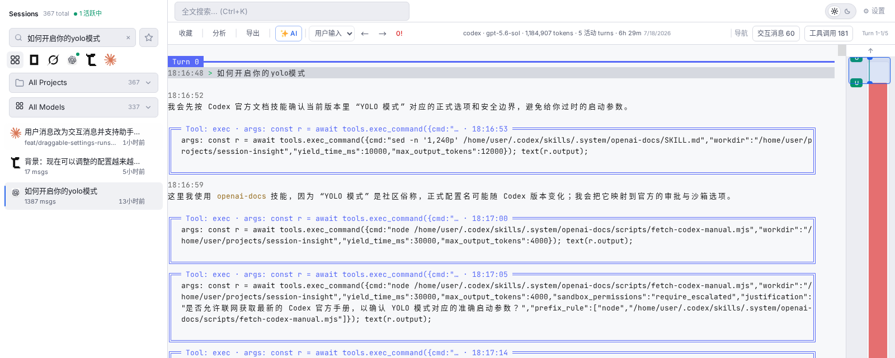
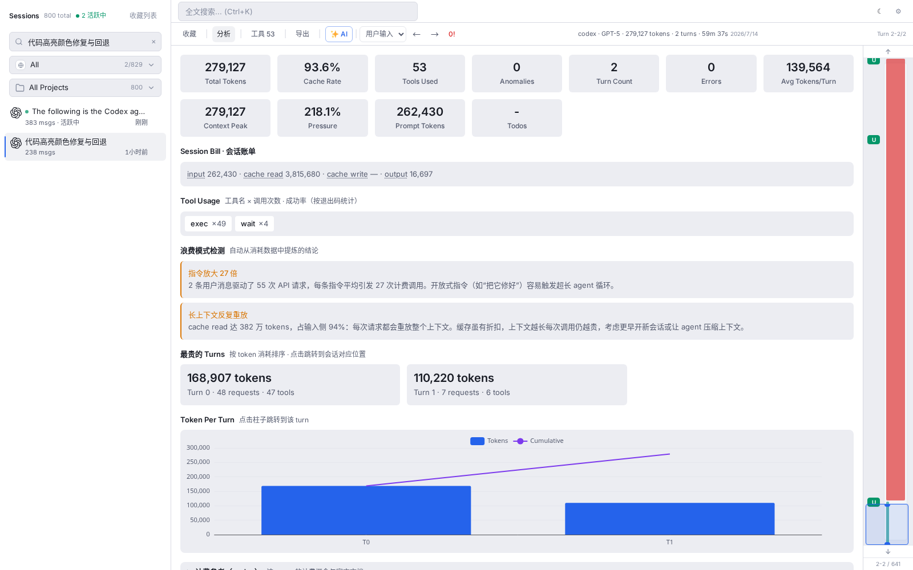
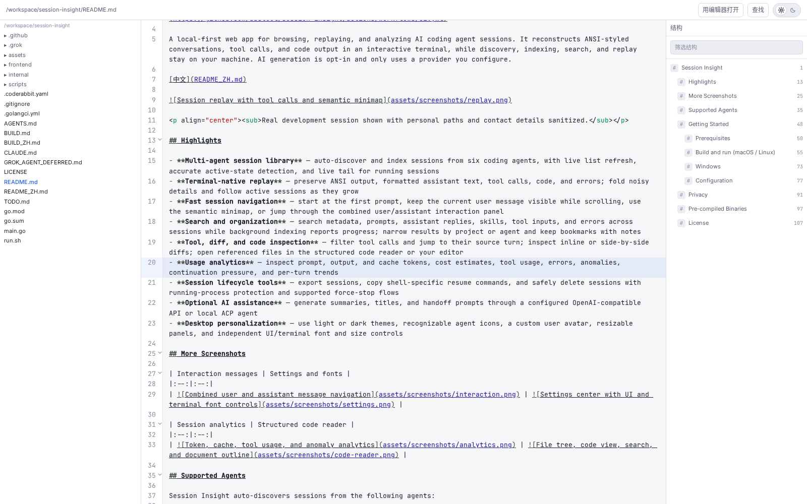

# Session Insight

[](https://github.com/bbsteel/session-insight/actions/workflows/ci.yml)

A local-first web app for browsing and analyzing AI coding agent sessions through terminal-native replay. It reconstructs ANSI-styled conversations, tool calls, and code output in an interactive terminal, while session discovery, indexing, search, and replay stay on your machine. AI generation is opt-in and may send selected session context to a provider you configure.

[中文](README_ZH.md)



<p align="center"><sub>Real development session shown with personal paths and contact details sanitized.</sub></p>

## Highlights

- **Multi-agent session library** — auto-discover and index sessions from five coding agents, with live list refresh and live tail for active sessions
- **Terminal replay and navigation** — replay ANSI output, fold tool calls, highlight code, use the semantic minimap, and jump between user messages, turns, anomalies, and compaction points
- **Search and organization** — full-text search across sessions, in-terminal regex/case/whole-word search, project and agent filters, plus bookmarks with notes
- **Tool, diff, and code inspection** — filter tool calls and jump to their source turn; inspect inline or side-by-side diffs; open referenced files in the structured code reader or your editor
- **Usage analytics** — inspect prompt, output, and cache tokens, cost estimates, tool usage, errors, anomalies, continuation pressure, and per-turn trends
- **Session lifecycle tools** — export sessions, copy shell-specific resume commands, and safely delete sessions with running-process protection and supported force-stop flows
- **Optional AI assistance** — generate summaries, titles, and handoff prompts through a configured OpenAI-compatible API or local ACP agent
- **Desktop-friendly UI** — resizable panels and dark/light themes for a local developer workflow

## More Screenshots

| Session analytics | Structured code reader |
|:--:|:--:|
|  |  |

## Supported Agents

Session Insight auto-discovers sessions from the following agents:

| Agent | Session location (auto-detected) |
|-------|----------------------------------|
| [Claude Code](https://claude.ai/code) | `~/.claude/projects/` |
| [Codex](https://github.com/openai/codex) | `~/.codex/sessions/` |
| [GitHub Copilot](https://github.com/features/copilot) | `~/.copilot/session-state/` |
| [opencode](https://opencode.ai) | opencode SQLite database (auto-resolved) |
| [Chrys](https://github.com/chrislatinae/chrys) | `~/.chrys/sessions/` |

## Getting Started

### Prerequisites

- Go 1.25+
- Node.js 18+

### Build and run (macOS / Linux)

```bash
git clone https://github.com/bbsteel/session-insight.git
cd session-insight
bash run.sh all
```

The app starts at **http://127.0.0.1:8080** and opens automatically in your browser.

### Windows

See [BUILD.md](BUILD.md) for the full Windows build guide (requires MSYS2 + mingw-w64 for CGO).

### Configuration

| Environment variable | Default | Description |
|----------------------|---------|-------------|
| `PORT` | `8080` | HTTP port |
| `SI_DATA_DIR` | `~/.session-insight` | Override the application database directory |
| `CHRYS_SESSION_ROOT_DIR` | — | Override Chrys session root directory |

When `run.sh` is executed from a linked Git worktree, it uses an OS-assigned
random loopback port on the first run and reuses the same port on subsequent
restarts (persisted to `.runtime/session-insight.port`), with an isolated
`.runtime/session-insight` data directory. The `Ready:` line reports the
actual full application URL.

## Privacy

Core browsing features operate locally. AI features remain disabled until you configure a model provider and explicitly request a generation. A generation sends a bounded excerpt of the selected session to the configured OpenAI-compatible endpoint or ACP agent; an ACP agent may in turn contact its own model provider.

API credentials are stored locally in the Session Insight SQLite database and are not returned to the browser after saving. Treat that local database as sensitive data.

## Pre-compiled Binaries

Versioned archives are published on the [GitHub Releases](https://github.com/bbsteel/session-insight/releases) page for:

- Linux x86-64 and arm64
- macOS Intel and Apple Silicon
- Windows x86-64

Each archive contains the executable, both READMEs, and the license. Download `checksums.txt` from the same release, then compare its matching entry with `sha256sum <archive>` on Linux/macOS or `Get-FileHash <archive> -Algorithm SHA256` in PowerShell.

## License

[MIT](LICENSE) © 2026 bbsteel
