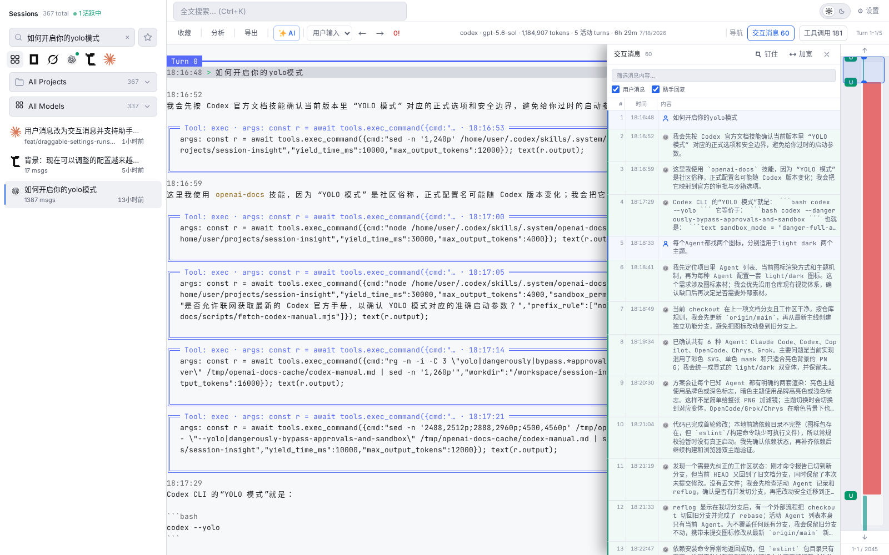
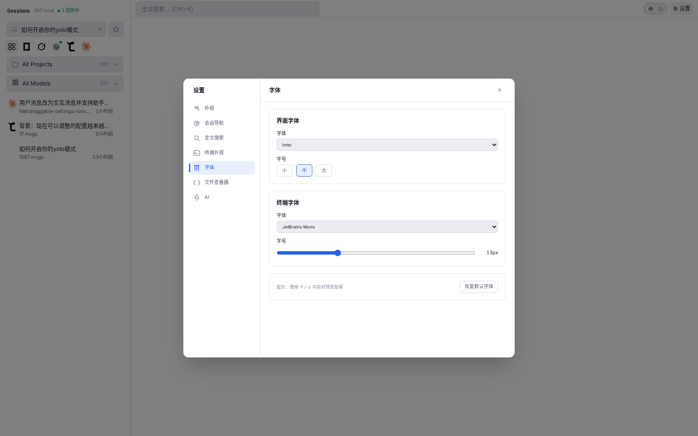

# Session Insight

[](https://github.com/bbsteel/session-insight/actions/workflows/ci.yml)

A local-first web app for browsing and analyzing AI coding agent sessions through terminal-native replay. It reconstructs ANSI-styled conversations, tool calls, and code output in an interactive terminal, while discovery, indexing, search, and replay stay on your machine. AI generation is opt-in and only uses a provider you configure.

[中文](README_ZH.md)


<p align="center"><sub>Real development session shown with personal paths and contact details sanitized.</sub></p>

## Highlights

- **Multi-agent session library** — auto-discover and index sessions from six coding agents, with live list refresh, accurate active-state detection, and live tail for running sessions
- **Terminal-native replay** — preserve ANSI output, formatted assistant text, tool calls, code, and errors; fold noisy details and follow active sessions as they grow
- **Fast session navigation** — start at the first prompt, keep the current user message visible while scrolling, use the semantic minimap, or jump through the combined user/assistant interaction panel
- **Search and organization** — search metadata, prompts, assistant replies, skills, tool inputs, and errors across sessions while background indexing reports progress; narrow results by project or agent and keep bookmarks with notes
- **Tool, diff, and code inspection** — filter tool calls and jump to their source turn; inspect inline or side-by-side diffs; open referenced files in the structured code reader or your editor
- **Usage analytics** — inspect prompt, output, and cache tokens, cost estimates, tool usage, errors, anomalies, continuation pressure, and per-turn trends
- **Session lifecycle tools** — export sessions, copy shell-specific resume commands, and safely delete sessions with running-process protection and supported force-stop flows
- **Optional AI assistance** — generate summaries, titles, and handoff prompts through a configured OpenAI-compatible API or local ACP agent
- **Desktop personalization** — use light or dark themes, recognizable agent icons, a custom user avatar, resizable panels, and independent UI/terminal font and size controls

## More Screenshots

| Interaction messages | Settings and fonts |
|:--:|:--:|
|  |  |

| Session analytics | Structured code reader |
|:--:|:--:|
|  |  |

## Supported Agents

Session Insight auto-discovers sessions from the following agents:

| Agent | Session location (auto-detected) |
|-------|----------------------------------|
| [Claude Code](https://claude.ai/code) | `~/.claude/projects/` |
| [Codex](https://github.com/openai/codex) | `~/.codex/sessions/` |
| [GitHub Copilot](https://github.com/features/copilot) | `~/.copilot/session-state/` |
| [opencode](https://opencode.ai) | opencode SQLite database (auto-resolved) |
| [Chrys](https://github.com/chrislatinae/chrys) | `~/.chrys/sessions/` |
| [Grok](https://grok.com) | `~/.grok/sessions/` |

## Download and Run

No Go or Node.js installation is required for the pre-built release.

1. Open the [latest GitHub Release](https://github.com/bbsteel/session-insight/releases/latest).
2. Download the archive for your platform:

   | Platform | Archive name |
   |----------|--------------|
   | Linux x86-64 | `session-insight-*-linux-amd64.tar.gz` |
   | Linux arm64 | `session-insight-*-linux-arm64.tar.gz` |
   | macOS Intel | `session-insight-*-darwin-amd64.tar.gz` |
   | macOS Apple Silicon | `session-insight-*-darwin-arm64.tar.gz` |
   | Windows x86-64 | `session-insight-*-windows-amd64.zip` |

3. Extract the archive and run `session-insight` (`session-insight.exe` on Windows).
4. Open **http://127.0.0.1:8080** if the browser does not open automatically.

Each archive includes the executable, both READMEs, and the license. To verify the download, get `checksums.txt` from the same Release and compare its matching entry with `sha256sum <archive>` on Linux/macOS or `Get-FileHash <archive> -Algorithm SHA256` in PowerShell.

## Build from Source

### Prerequisites

- Go 1.25+
- Node.js 18+

### Build and run (macOS / Linux)

```bash
git clone https://github.com/bbsteel/session-insight.git
cd session-insight
bash run.sh all
```

The app starts at **http://127.0.0.1:8080** and opens automatically in your browser.

Useful runtime commands:

```bash
./run.sh status       # list the current app and linked-worktree instances
./run.sh restart      # stop and start this checkout without rebuilding
./run.sh stop         # stop only this checkout's instance
```

### Windows

See [BUILD.md](BUILD.md) for the full Windows build guide (requires MSYS2 + mingw-w64 for CGO).

### Configuration

| Environment variable | Default | Description |
|----------------------|---------|-------------|
| `PORT` | `8080` | HTTP port |
| `SI_DATA_DIR` | `~/.session-insight` | Override the application database directory |
| `CHRYS_SESSION_ROOT_DIR` | — | Override Chrys session root directory |

When `run.sh` is executed from a linked Git worktree, it uses an OS-assigned
random loopback port on the first run and reuses the same port on subsequent
restarts (persisted to `.runtime/session-insight.port`), with an isolated
`.runtime/session-insight` data directory. The `Ready:` line reports the
actual full application URL.

## Privacy

Core browsing features operate locally. AI features remain disabled until you configure a model provider and explicitly request a generation. A generation sends a bounded excerpt of the selected session to the configured OpenAI-compatible endpoint or ACP agent; an ACP agent may in turn contact its own model provider.

API credentials are stored locally in the Session Insight SQLite database and are not returned to the browser after saving. Treat that local database as sensitive data.

## License

[MIT](LICENSE) © 2026 bbsteel
